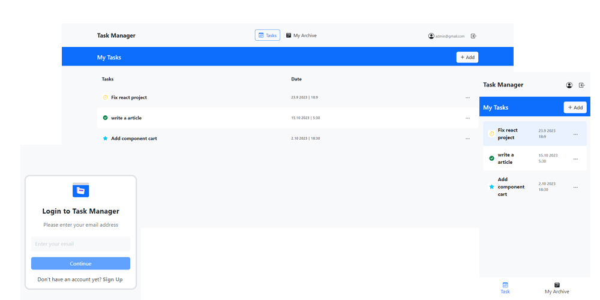

# Task Manager

This is link Demo [Task Manager](https://task-manager-karimi.vercel.app/)

This project is a task manager that is implemented with React.
The project features include:

- Add task
- Edit task
- Registration
- Archive task
- Change status task(new, process, completed)

The technology used in the project includes:

- [Framework React Bootstrap 5](https://react-bootstrap.netlify.app/)
- [Redux-Toolkit](https://redux-toolkit.js.org/)
- [React-datepicker](https://reactdatepicker.com/)
- [React-device-detect](https://github.com/duskload/react-device-detect)

# React + Vite

This template provides a minimal setup to get React working in Vite with HMR and some ESLint rules.

Currently, two official plugins are available:

- [@vitejs/plugin-react](https://github.com/vitejs/vite-plugin-react/blob/main/packages/plugin-react/README.md) uses [Babel](https://babeljs.io/) for Fast Refresh
- [@vitejs/plugin-react-swc](https://github.com/vitejs/vite-plugin-react-swc) uses [SWC](https://swc.rs/) for Fast Refresh
